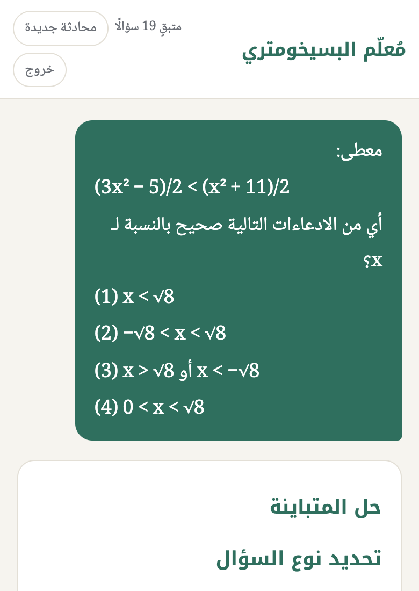
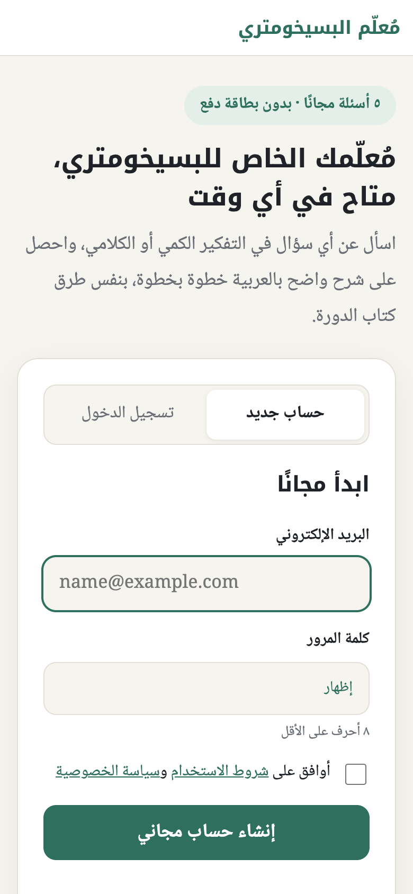
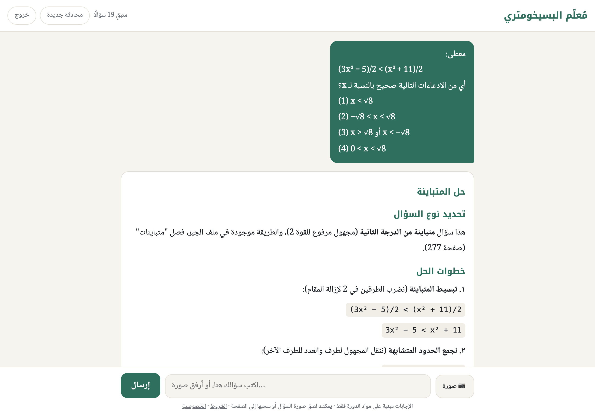
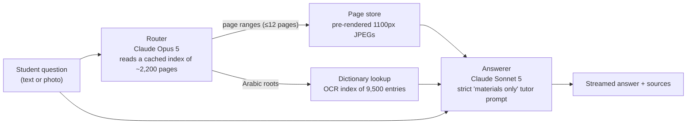

# Psychometric AI Tutor

**An Arabic-language AI tutor for the Israeli Psychometric Entrance Exam that answers only from a licensed course library, and costs about $0.07 per question.**

Students type a question (or photograph one from their book), and the tutor solves it step by step in Arabic, using the methods taught in the course and citing the book and page it relied on. When the course material doesn't cover something, it says so instead of guessing.

<p align="center">
  
  &nbsp;&nbsp;
  
</p>



---

## What it does

- **Step-by-step solutions** in Arabic, right-to-left, with math kept readable left-to-right, following the course's own methods.
- **Photo questions:** paste, drag, or snap a photo of a question; the tutor reads it and solves it.
- **Word meanings from *al-Qamus al-Muhit***, a 1,800-page scanned classical Arabic dictionary, for verbal-reasoning analogies.
- **Sources under every answer:** book and page numbers.
- **Accounts and payments:** 5 free questions on signup, then a one-time package through Stripe Checkout. Includes an admin dashboard for revenue, usage, AI cost and margin.

## How it works



1. **Routing.** The course library is far too large to send with every question (about 2,200 pages). A router call gets a compact index (the running header and first line of each run of pages) and returns the page ranges and dictionary roots the question needs. The index is prompt-cached for an hour, so this step costs about $0.02.
2. **Dictionary lookup.** Roots are resolved to pages of the scanned dictionary (see below).
3. **Answering.** The selected pages go to the answer model as images, together with the student's question and photos, under a system prompt that restricts it to the attached material.

## Engineering highlights

**Cutting cost by 78% without losing accuracy, measured rather than guessed.** I built an evaluation set of 18 questions with known answers (quantitative, analogies, word meanings, photo questions) and ran the real server under each configuration, grading final answers automatically:

| Configuration | Correct | Avg. cost / question |
|---|---|---|
| PDF pages, up to 30, Opus answers | 18/19 | $0.32 |
| Page images instead of PDFs | 18/19 | $0.19 |
| Images, up to 12 pages, Opus answers | 16/19* | ~$0.15 |
| Images, 12 pages, Sonnet routes *and* answers | 17/19 | ~$0.09 |
| **Opus routes, Sonnet answers, 12 pages (shipped)** | **18/18** | **$0.07** |

<sub>First four rows: first round with 19 questions. The last row is from the second round with 18, after English was removed from scope. \*Two misses traced to a bug where the model confused the student's photo with an attached book page. Labelling the photo fixed it, and the fix was verified in the second round.</sub>

What made the difference:
- **Images instead of PDFs.** The PDFs' Arabic text layer is garbled (presentation forms, swapped letters), yet the API bills each PDF page as image *plus* text. A 1100px JPEG costs 1,123 tokens against about 2,200 for the PDF page, and the text wasn't adding anything.
- **Splitting the work.** Choosing the right pages needs the stronger model; writing the explanation once the pages are right doesn't.
- **Cache-aware prompt layout.** The large index sits first in the router prompt with its own cache breakpoint, so changing rules or limits doesn't invalidate it. A second breakpoint after the attached pages lets students asking about the same topic reuse each other's cached prefix. Page images are byte-identical across requests, so the cache actually hits.

**Making a scanned dictionary searchable, on-device and for free.** The dictionary has no text layer. I OCR'd all 1,800 pages with macOS's Vision framework (a small Swift tool) and extracted the numbered entry headers (e.g. `٢٦١٩ - خنبث`). OCR confuses letters that differ only by dots (ح/ج/خ), which breaks alphabetical search, so:
- each entry's first letter is corrected from the page's running chapter header ("حرف الحاء"), smoothed across neighbouring pages;
- lookup picks the split point with the fewest out-of-order entries within the chapter, instead of a binary search that a single misread entry can derail;
- inexact matches also return the neighbouring pages.

On 48 test roots, every lookup landed on the correct page.

**Messy Arabic sources.** Course PDFs extract as broken Arabic, so the indexer normalises them (NFKC) and the router prompt teaches the model to read through the noise. The answer model never sees the broken text, only page images.

**Product details that matter.** Each message reserves one question atomically and refunds it if no answer is delivered. The Stripe webhook is signature-verified and idempotent. Passwords use scrypt, and session and reset tokens are stored hashed. Password reset logs out other devices. Student messages render each line in its own direction, so Arabic reads right-to-left and math left-to-right.

## Tech stack

Node.js · Express · Anthropic API (Claude Opus 5 + Sonnet 5, prompt caching, streaming, structured outputs) · pdf-lib / pdf.js · Swift + macOS Vision (OCR) and PDFKit (rendering) · SQLite (better-sqlite3) · Stripe Checkout · Docker · Fly.io · vanilla JS, RTL-first UI

## Repository layout

```
server.js            routing, dictionary lookup, answering, SSE streaming, cost tracking
accounts.js, db.js   accounts, sessions, question balance, Stripe, admin stats
system-prompt.md     the tutor's rules (Arabic only, materials only, RTL formatting)
build-index.js       page index from the course PDFs' text layer
tools/               OCR and rendering (Swift), dictionary indexer, page renderer
eval/                evaluation questions and runner
public/              chat UI, signup, admin dashboard, legal pages
```

## Running it

The course books are licensed material and are **not included** in this repository. To run it with your own PDFs:

```bash
npm install
cp .env.example .env                  # add ANTHROPIC_API_KEY
# put PDFs in materials/ (and the scanned dictionary in materials/dictionary/)
npm run index                         # page index
node tools/render-pages.js            # page images (macOS)
npm run index:dictionary              # dictionary OCR index (macOS, ~15 min)
npm start                             # http://localhost:3000
```

---

## בעברית

**מורה פרטי מבוסס בינה מלאכותית לבחינה הפסיכומטרית, בערבית.** התלמיד כותב שאלה או מצלם אותה מהספר, והמערכת פותרת אותה שלב אחר שלב לפי שיטות הקורס בלבד, עם הפניה לספר ולעמוד. המערכת בוחרת בכל שאלה את העמודים הרלוונטיים מתוך כ-2,200 עמודים, ומחפשת פירושי מילים במילון סרוק של 1,800 עמודים. את הזיהוי האופטי (OCR) בניתי בעצמי, והוא רץ על המחשב המקומי. בעזרת מערך בדיקה עם תשובות ידועות הורדתי את העלות לשאלה ב-78% (מ-$0.32 ל-$0.07), בלי לפגוע בדיוק. כולל הרשמה, תשלום דרך Stripe, לוח ניהול, ופריסה ב-Fly.io.

---

<sub>Built by Deia Nsasra, with [Claude Code](https://claude.com/claude-code) as an AI pair programmer.</sub>
